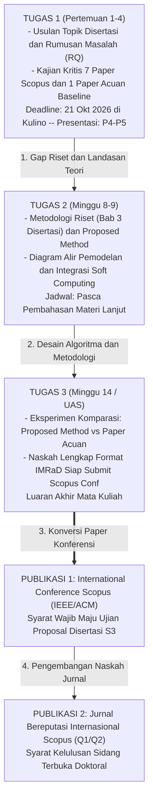
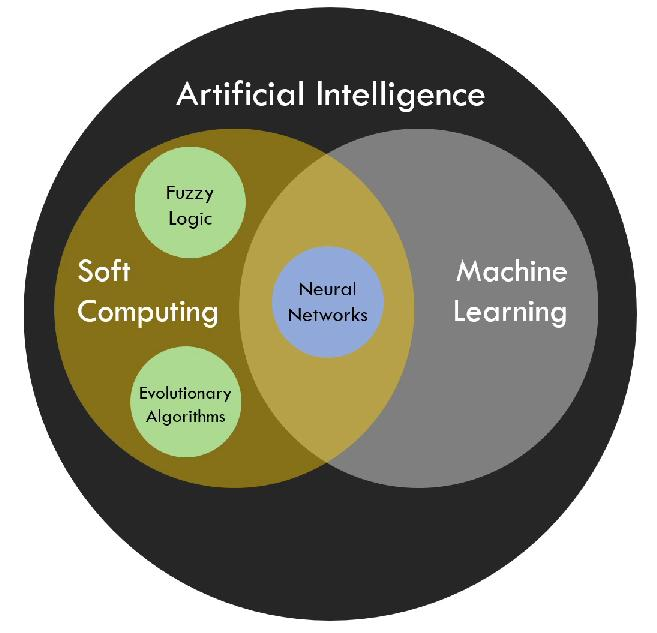

# 📌 Catatan Perkuliahan: Komputasi Lunak Lanjut (Pertemuan 1)
**Mata Kuliah:** Advanced Soft Computing (Komputasi Lunak Lanjut)  
**Dosen Pengampu:** Prof. Dr. A. Zainul Fanani, S.Si., M.Kom. (Tim Dosen: Prof. Dr. Nova, Dr. Ruri)  
**Program:** Program Doktor Ilmu Komputer (PDIK) - Universitas Dian Nuswantoro (UDINUS)  
**Waktu:** Perkuliahan Perdana Semester Gasal 2026/2027 (~68 menit)  

> 📂 **Berkas Resmi Perkuliahan Tersedia di Repositori:**  
> 1. [1. Pengantar_Soft_Computing_Kontrak.pdf](./1.%20Pengantar_Soft_Computing_Kontrak.pdf) (Silabus & Kontrak Kuliah)  
> 2. [2. Soft Computing - Pertemuan 01 - Introduction to Soft_Computing.pdf](./2.%20Soft%20Computing%20-%20Pertemuan%2001%20-%20Introduction%20to%20Soft_Computing.pdf) (Slide Presentasi Teori 22 Halaman)  
> 3. [Tugas 1 SoftComputing 2026.pdf](./Tugas%201%20SoftComputing%202026.pdf) (Panduan Resmi Tugas 1)

---

## 🧭 Pendahuluan & Filosofi Asesmen Doktoral

Perkuliahan perdana mata kuliah **Komputasi Lunak Lanjut (Advanced Soft Computing)** diampu oleh **Prof. Dr. A. Zainul Fanani, S.Si., M.Kom.**. Prof. Fanani menegaskan bahwa iklim asesmen pada jenjang Doktor (S3) berorientasi 100% pada **Project & Output-Based Learning**:

* **Bebas Ujian Tertulis Konvensional (UTS / UAS):** Evaluasi perkuliahan berpusat pada penugasan riset bertahap yang diselaraskan langsung dengan **rencana topik Disertasi S3**.
* **Jaminan Penilaian Objektif:** Mahasiswa yang pada akhir semester telah menyelesaikan naskah paper siap submit dijamin memperoleh nilai yang sangat memuaskan (*"nilainya otomatis apik lah ngono wae"*).
* **Kewajiban Publikasi Doktoral UDINUS (Arahan Prof. Aris):**  
  Mahasiswa S3 diwajibkan menghasilkan minimal 2 publikasi Scopus:
  1. *Publikasi 1 (Pra-Proposal):* International Conference Scopus (IEEE/ACM) sebagai syarat maju Ujian Proposal Disertasi. **(Ditargetkan langsung dari Tugas 3 mata kuliah ini!)**
  2. *Publikasi 2 (Kelulusan Disertasi):* Jurnal Internasional Bereputasi Scopus (Q1/Q2) yang memuat perbaikan metode (*method improvement*).
* **Target Output:** Di akhir semester, mahasiswa menghasilkan **draf naskah ilmiah format IMRaD siap *submit* ke International Conference terindeks Scopus (IEEE/ACM/Scopus)**.

---

## 1. 📅 Roadmap 3 Tugas Berkelanjutan (Semester 1)

Penugasan perkuliahan dirancang terstruktur dalam 3 tahapan yang saling menyambung:

### 🔹 Tugas 1: Usulan Topik & Review 7 Paper Scopus (Deadline Upload: 21 Oktober 2026 di Kulino | Presentasi: Pertemuan 4–5)
1. **Penyusunan Usulan:** Menuliskan Usulan Penelitian dengan membuat Judul/Topik yang disesuaikan dengan bidang kompetensi yang dikuasai atau sedang tren, dan direncanakan untuk Topik Disertasi.
2. **Komponen Pendahuluan & Isi:**
   * Judul & Topik Penelitian (dapat dikonsultasikan selama perkuliahan).
   * Pendahuluan / Latar Belakang Masalah empiris.
   * Rumusan Masalah (*Research Questions*).
3. **Review Literatur:** Mengulas **$\pm 7$ paper Scopus (5 tahun terakhir)** untuk mencari *state of the art* ($\sim 0,5$ halaman per paper, total $\sim 3,5$ halaman: masalah, metode, capaian hasil, keunggulan, serta kelemahan/gap).
4. **Penetapan "Paper Acuan" (Baseline Benchmark Paper):**  
   Dari 7 paper yang direview, mahasiswa **wajib menunjuk 1 paper utama sebagai Paper Acuan (Riset Acuan)**. Paper acuan inilah yang menjadi lawan tanding (*benchmark*) di mana kelemahannya akan diperbaiki dan metrik performanya akan dikalahkan oleh metode usulan kita.
5. **Jadwal Presentasi & Kontinuitas Tugas Akhir:**  
   * Disiapkan untuk dipresentasikan pada **Pertemuan 4–5**.
   * Tugas 1 ini merupakan fondasi awal yang akan diteruskan menjadi tugas lanjutan (**Tugas Akhir Matakuliah Soft Computing**) berupa Paper IMRaD atau Usulan Proposal Disertasi yang dikumpulkan pada pertemuan akhir matakuliah ini.

### 🔹 Tugas 2: Proposed Method & Metodologi / Bab 3 (Deadline: ~Minggu ke-8/9)
1. Menguraikan metode yang diusulkan (*proposed method*) atau kombinasi algoritma baru.
2. Menyusun diagram alir tahapan eksperimen standar Bab 3:
   $$\text{Dataset (Publik/Privat)} \longrightarrow \text{Preprocessing} \longrightarrow \text{Eksperimen Pemodelan} \longrightarrow \text{Evaluasi / Validasi}$$
3. Mengidentifikasi secara eksplisit di mana letak instrumen Soft Computing (optimasi, hybrid, ensemble) akan disematkan untuk meningkatkan performa sistem.

### 🔹 Tugas 3: Eksperimen Baseline & Draf Paper Publikasi IMRaD (Deadline: ~Minggu ke-14)
1. Melakukan eksperimen awal (*baseline experiment*) menggunakan data benchmark publik atau studi kasus mandiri.
2. Menyusun draf naskah paper berstandar internasional dengan format **IMRaD** (*Introduction, Methods, Results, and Discussion*).
3. Luaran: Paper siap submit ke *International Conference* terindeks Scopus (IEEE/ACM/Scopus).

---

## 2. 🧠 Fondasi Teoretis, Taksonomi, & Peran Strategis Soft Computing (Slide Pertemuan 01 & Dokumen Kontrak)

Berdasarkan pengkajian mendalam terhadap **3 berkas PDF resmi** perkuliahan yang diunggah Prof. Dr. Ahmad Zainul Fanani, S.Si., M.Kom.:

### A. Pertanyaan Pemantik & 6 Capaian Pembelajaran Doktoral (Learning Outcomes)
* **Pertanyaan Pemantik Riset (Slide 2):**  
  > *"WHY DO WE NEED SOFT COMPUTING? Apakah semua masalah komputasi dapat dirumuskan dengan aturan yang pasti, data yang lengkap, dan solusi eksak?"*
* **6 Capaian Pembelajaran Doktoral / Learning Outcomes (Slide 3):**
  1. Menjelaskan konsep, karakteristik, dan filosofi dasar Soft Computing.
  2. Membedakan secara presisi antara *hard computing*, *soft computing*, *machine learning*, dan *intelligent systems*.
  3. Mengidentifikasi dan menjelaskan sumber ketidakpastian (*uncertainty*), ketidaktepatan (*imprecision*), dan kompleksitas dalam masalah komputasi nyata.
  4. Memetakan *Fuzzy Logic*, *Neural Computing*, *Evolutionary Computation*, dan *Swarm Intelligence* sebagai pilar pendekatan Soft Computing.
  5. Menganalisis secara kritis kapan pendekatan Soft Computing layak dan tepat digunakan dalam penelitian doktoral.
  6. Merumuskan pertanyaan riset awal (*research questions*) terkait penerapan Soft Computing untuk melahirkan *novelty*.

### B. Konteks Luas AI & Pipeline 5 Tahap Sistem Cerdas (Slide 4–5)
* **AI sebagai Ekosistem:** AI adalah bidang yang mempelajari sistem komputasi untuk melakukan tugas-tugas cerdas (*reasoning, learning, perception, planning, optimization, decision making*). AI bukan satu algoritma tunggal, melainkan sebuah ekosistem pendekatan dan teknik.
* **Pipeline Rantai Nilai Sistem Cerdas (*Intelligent System Pipeline*):**
  $$\text{Sensing} \longrightarrow \text{Representation} \longrightarrow \text{Reasoning / Learning} \longrightarrow \text{Decision} \longrightarrow \text{Action}$$
* **Fokus Utama Sistem Cerdas:** Menghasilkan perilaku yang adaptif (*adaptive behaviour*) dan mampu memecahkan masalah (*problem-solving*) di tengah lingkungan yang dinamis.

### C. Definisi Formal, Formula Fundamental, & Diagram Venn Hubungan Himpunan
* **Definisi Formal:** Soft Computing (SC) adalah paradigma komputasi yang menekankan toleransi terhadap **ketidakpastian (*uncertainty*)**, **ketidaktepatan (*imprecision*)**, dan **aproksimasi (*approximation*)**.
* **Tujuan Utama:** Menghasilkan solusi yang dapat diterima (*acceptable*), adaptif (*adaptive*), kokoh (*robust*), atau mendekati optimal (*near-optimal*) dengan biaya komputasi rendah.
* **Formula Fundamental Soft Computing:**
  $$SC = FS + NN + EA + SI$$
  * **FS (Fuzzy Systems / Fuzzy Logic):** Penalaran di bawah ketidakjelasan (*reasoning under vagueness*).
  * **NN (Neural Networks / Neural Computing):** Pembelajaran pemetaan non-linear dari data (*learning nonlinear mappings*).
  * **EA (Evolutionary Algorithms / Evolutionary Computation):** Pencarian dan optimasi terinspirasi mekanisme evolusi biologis (*evolution-inspired search*).
  * **SI (Swarm Intelligence):** Optimasi berbasis populasi terinspirasi perilaku kolektif kawanan biologis (*collective behavior*).
* **Diagram Venn Relasi AI, Soft Computing, & Machine Learning (Slide Kontrak Halaman 2):**

  

### D. Mengapa Disebut 'Soft'? (Hard Computing vs Soft Computing) (Slide 7–8)
* **Hard Computing:** Berpijak pada aturan deterministik (*deterministic rules*), representasi eksak, komputasi presisi analitis, dan batasan ketat (*strict constraints*). Tepat digunakan ketika model matematis, data masukan, dan aturan sistem bernilai pasti.
* **Soft Computing:** Mengizinkan derajat keanggotaan (*degree of membership*), probabilitas stokastik, toleransi kesalahan (*error tolerance*), pencarian heuristik, dan solusi aproksimatif. Relevan ketika sistem dunia nyata terlalu kompleks untuk dimodelkan secara analitis tertutup.
* **Makna Filosofis 'Soft':** *"Soft bukan berarti lemah; 'soft' merujuk pada fleksibilitas sistem terhadap ketidakpastian dan ketidaktepatan."* Kualitas solusi ditentukan oleh konteks masalah dan kriteria evaluasi yang ditetapkan.

### E. Enam Sumber Kesulitan Masalah Dunia Nyata (*Sources of Difficulty*) (Slide 9)
Prof. Fanani memetakan 6 alasan mendasar mengapa pendekatan eksak konvensional (Hard Computing) gagal di dunia nyata:
1. **Uncertainty:** Informasi tidak lengkap (*incomplete*) atau memiliki ketidakpastian stokastik.
2. **Vagueness:** Konsep bersifat linguistik subjektif atau batas kategori tidak tegas (contoh: "rendah", "sedang", "tinggi").
3. **Noise:** Data mengandung gangguan transmisi atau kesalahan pengukuran sensor.
4. **Complexity:** Hubungan antar-variabel terlampau rumit untuk dirumuskan secara analitis eksplisit.
5. **Nonlinearity:** Perubahan pada variabel masukan (*input*) tidak menghasilkan perubahan keluaran (*output*) yang proporsional/linear.
6. **Large Search Space:** Jumlah kandidat kombinasi solusi sangat masif (*combinatorial explosion*), membuat pencarian eksak menjadi mustahil secara waktu (*NP-hard*).

### F. Aproksimasi sebagai Strategi Komputasi (Slide 10)
* Tidak semua masalah menuntut solusi eksak 100%.
* Secara umum, tujuan optimasi dirumuskan sebagai:
  $$x^* = \arg\min f(x) \quad \text{atau} \quad x^* = \arg\max f(x)$$
* Pada Soft Computing, pencarian $x^*$ dilakukan secara heuristik atau berbasis populasi (*population-based*).
* **Pertanyaan Riset Kritis S3:** *"Seberapa dekat solusi aproksimasi terhadap titik optimum sejati, dan seberapa mahal biaya komputasi (*computational cost*) yang dibutuhkan?"*

### G. Karakteristik, Keunggulan & Keterbatasan 4 Paradigma Inti (Slide 11–14)

| Paradigma Soft Computing | Formulasi / Elemen Kunci | Kekuatan / Keunggulan | Keterbatasan / Kelemahan |
| :--- | :--- | :--- | :--- |
| **1. Fuzzy Computing** | $\mu(x) \in [0,1]$ Rule-based: *IF-THEN* | • Aturan interpretable & jelas. • Representasi pengetahuan linguistik eksplisit. | • Desain fungsi keanggotaan dan rule base rentan subjektivitas pakar. |
| **2. Neural Computing** | $y = \phi(\sum w_i x_i + b)$ | • Aproksimasi fungsi non-linier universal. • Pembelajaran berbasis data (*data-driven*). | • Butuh dataset besar & waktu training; • Model cenderung kotak hitam (*black box*). |
| **3. Evolutionary Computing** | GA: 6 Elemen Kunci (*Representation, Population, Fitness, Selection, Variation, Replacement*) | • Bebas turunan matematis (*derivative-free*). • Mampu menjelajahi ruang pencarian global luas. | • Evaluasi fitness mahal komputasinya; • Risiko konvergensi prematur (*local optima*). |
| **4. Swarm Intelligence** | PSO (*pbest & gbest*); ACO (*pheromone & trail probability*) | • Desentralisasi kolektif. • Keseimbangan eksplorasi dan eksploitasi solusi. | • Sangat sensitif terhadap parameter kontrol (kecepatan, bobot inersia, feromon). |

### H. Peta Konseptual Paradigma & Sistem Cerdas Hibrida (Slide 15 & 18)
* **Peta Konseptual Relasi (Slide 15):**
  * Fuzzy Computing $\longrightarrow$ *Reasoning under vagueness*
  * Neural Computing $\longrightarrow$ *Learning nonlinear mappings from data*
  * Evolutionary Computation $\longrightarrow$ *Search and optimization through evolution-inspired mechanisms*
  * Swarm Intelligence $\longrightarrow$ *Population-based optimization through collective behavior*
  * Hybrid Intelligent Systems $\longrightarrow$ Menggabungkan kekuatan beberapa paradigma untuk mengatasi limitasi
* **Bentuk-Bentuk Hibridisasi Cerdas (Slide 18):**
  * **Neuro-Fuzzy (ANFIS):** Menggabungkan kapasitas belajar adaptif dari ANN dengan keterpahaman (*interpretability*) aturan Fuzzy.
  * **Evolutionary-Neural:** Optimasi evolusioner (GA/PSO) untuk merancang arsitektur/bobot jaringan saraf + pembelajaran neural.
  * **Evolutionary-Fuzzy:** Pencarian evolusi untuk mengoptimasi bentuk fungsi keanggotaan (*membership function*) atau basis aturan fuzzy.
  * **Prinsip Utama Hibridisasi Prof. Fanani:** *"Tujuan sistem hybrid bukan sekadar menambah-nambah algoritma, melainkan mengatasi keterbatasan spesifik yang telah teridentifikasi pada metode tunggal!"*

### I. Distingsi Kritis: Soft Computing vs Machine Learning & Deep Learning (Slide 16–17)
* **Machine Learning:** Berfokus spesifik pada algoritma yang mempelajari pola atau fungsi dari data historis.
* **Soft Computing:** Merupakan paradigma/filosofi pemecahan masalah (*problem-solving philosophy*) yang memayungi beberapa keluarga pendekatan.
* **Irisan:** ANN berada pada perpotongan antara Soft Computing dan Machine Learning. Genetic Algorithm (GA) dapat digunakan untuk optimasi murni maupun ML. Fuzzy Logic dapat berjalan tanpa data pelatihan sama sekali (*expert rule base*).
* **Deep Learning:** Merupakan pengembangan neural network dengan banyak lapisan tersembunyi (*deep layers*) dan representasi bertingkat. Secara historis berakar dari Soft Computing, namun dalam ekosistem AI modern lebih tepat dipahami sebagai domain Machine Learning berbasis representasi bertingkat.

### J. Kapan Soft Computing Layak Digunakan dalam Riset? (Slide 19)
Prof. Fanani menegaskan bahwa **pemilihan metode harus didasarkan pada karakteristik masalah, bukan sekadar popularitas algoritma**. Soft Computing layak digunakan apabila:
1. Pemodelan matematika eksak sulit, tidak praktis, atau terlalu mahal.
2. Data bersifat *noisy, incomplete, vague*, atau heterogen.
3. Ruang pencarian solusi (*search space*) berskala sangat besar.
4. Fungsi objektif bersifat non-konveks atau tidak dapat diturunkan (*non-differentiable*).
5. Diperlukan *trade-off* multi-kriteria antara akurasi, kekokohan (*robustness*), keterpahaman (*interpretability*), dan biaya komputasi (*computational cost*).

### K. Kerangka 7 Langkah: *"From Problem to Method"* (Slide 21)
Tujuh langkah terstruktur untuk merumuskan riset berbasis Soft Computing tingkat doktoral:
1. **Identifikasi karakteristik masalah.**
2. **Formulasikan objective, variables, constraints, dan data.**
3. **Tentukan baseline dan evaluation metrics.**
4. **Pilih paradigma Soft Computing yang sesuai.**
5. **Rancang eksperimen dan parameter.**
6. **Evaluasi secara kuantitatif dan kritis.**
7. **Analisis limitation dan research contribution.**

### L. Enam Pertanyaan Riset (*Research Questions*) Standar Doktoral Soft Computing (Slide 20)
Slide Prof. Fanani merumuskan 6 pertanyaan riset baku yang harus dijawab dalam naskah ilmiah S3:
1. *Apakah metode baru menghasilkan solusi yang lebih baik daripada baseline?*
2. *Apakah hibridisasi benar-benar memberikan perbaikan (*improvement*) yang signifikan?*
3. *Bagaimana sensitivitas model terhadap variasi parameter?*
4. *Bagaimana ketahanan (*robustness*) model terhadap noise, missing data, atau pergeseran distribusi data (*drift*)?*
5. *Bagaimana trade-off antara accuracy, interpretability, convergence speed, dan computational cost?*
6. *Apakah hasil eksperimen reproducible pada dataset atau kondisi operasional lain?*

### M. Lima Poin Rangkuman Resmi (Summary Slide 22)
1. Soft Computing menangani masalah yang sulit dimodelkan secara eksak melalui pendekatan aproksimatif, adaptif, dan toleran terhadap ketidakpastian.
2. Fuzzy, Neural, Evolutionary, dan Swarm merupakan keluarga pendekatan utama.
3. Soft Computing beririsan dengan Machine Learning dan Intelligent Systems, tetapi tidak identik dengannya.
4. Hybrid Intelligent Systems menggabungkan metode untuk mengatasi keterbatasan pendekatan tunggal.
5. **Pesan Doktoral Utama:** *"Pada level S3, fokus utama bukan hanya menjalankan algoritma, tetapi menganalisis asumsi, trade-off, evaluasi, dan peluang kontribusi ilmiah."*

### N. Strategi Roadmap Riset 3 Tahun: Baseline vs. Disertasi Akhir
Prof. Fanani menegaskan bahwa riset doktoral (S3) **wajib menghasilkan perbaikan metode (*method improvement*)**, bukan sekadar menerapkan metode yang sudah ada ke data/objek baru (yang merupakan porsi riset S1).

* **Tahun 1 (Membangun Baseline):**  
  Ujikan metode *state-of-the-art* (Deep Learning, CNN, LSTM, Transformer) pada domain masalah yang belum pernah dicoba orang lain. Jika hasil akurasi baseline masih lebih rendah dari metode pembanding (misal: akurasi kita 94% sedangkan pembanding 96%), **itu wajar dan sah**. Kelemahan tersebut diulas secara jujur dalam sesi *Discussion* paper konferensi.
* **Tahun 2 & 3 (Injeksi Soft Computing untuk Disertasi & Jurnal Q1/Q2):**  
  Kelemahan baseline tahun pertama diperbaiki menggunakan 4 pilar instrumen Soft Computing:
  1. **Swarm Intelligence & Optimasi (PSO, ACO, Bee Colony):** Untuk optimasi hyperparameter, seleksi fitur, dan penyesuaian bobot adaptif.
  2. **Evolutionary Algorithms (Genetic Algorithm):** Untuk pencarian arsitektur optimal (*Neural Architecture Search*) dan optimasi multi-objektif.
  3. **Ensemble Learning:** Menggabungkan multi-model (Stacking, Boosting) untuk meningkatkan generalisasi dan mereduksi bias/variansi.
  4. **Hybrid Methods (Neuro-Fuzzy / ANFIS):** Menggabungkan logika fuzzy dengan jaringan saraf tiruan untuk penalaran ketidakpastian.

---

## 3. 💡 Tips Praktis Pengumpulan Referensi & Kesiapan Promotor

* **Jangan Buang Paper yang Terkumpul:** Untuk tugas ini pilih 7 paper Scopus yang paling mendekati (*mirror topic*). Namun, seluruh paper lain yang sudah diunduh (misal 50–100 paper) simpan semuanya sebagai modal berharga naskah disertasi.
* **Modal Kuat Menghadapi Promotor di Semester 2:**  
  Saat pembagian promotor dilakukan di Semester 2, mahasiswa yang sudah memiliki katalog literatur rapi, rumusan RQ/RO, bagan alir Bab 3, dan eksperimen awal baseline tidak akan dapat ditolak oleh promotor, sehingga proses bimbingan berjalan cepat dan terarah.

---

## 4. 🏛️ Pesan Sowan ke UDINUS Semarang & Solidaritas Angkatan 2026

* **Wajib Berkunjung ke Kampus UDINUS Semarang:**  
  Meskipun perkuliahan berjalan daring/hybrid, Prof. Fanani berpesan agar minimal setahun sekali mahasiswa menyempatkan diri datang ke kampus UDINUS di Semarang (minimal seminggu) untuk sowan dan berdiskusi langsung dengan calon promotor: **Prof. Dr. Aris Marjuni** (Kaprodi), **Dr. Pulung Nurtantio Andono** (Wakil Dekan / CV), **Dr. Farikhin** (Soft Computing), dan **Dr. M. Arief Soeleman** (Image Processing).  
  *Patokan Kampus:* Tepat di jantung kota Semarang dekat **Tugu Muda dan Lawang Sewu**. *"Kalau gak pernah ke Udinus jangan harap lulus dulu! 3 tahun mosok gak pernah ke Udinus."*
* **Solidaritas Angkatan 2026 (70% Mahasiswa Kalimantan):**  
  Prof. Fanani mendorong mahasiswa membuat grup mandiri angkatan 2026 untuk saling mereview draf tugas, memecahkan kebuntuan koding/algoritma, dan menjaga semangat agar seluruh rekan satu angkatan dapat lulus bersama tepat 3 tahun.
* **Format Perkuliahan Mingguan (Mulai Pertemuan 2):** $\sim 1$ jam materi teori dasar/lanjutan Soft Computing, dilanjutkan sesi interaktif bedah topik dan konsultasi progres riset mahasiswa secara bergantian satu per satu.
* **Portal Akademik & Upload Tugas:**  
  - **KULINO (`kulino.dinus.ac.id`):** LMS resmi untuk mengunduh materi dan mengunggah (*upload*) berkas Tugas 1, 2, dan 3.  
  - **SIADIN / Mahasiswa (`mhs.dinus.ac.id`):** Portal presensi perkuliahan mahasiswa per sesi.

---
*Catatan ini dirangkum dari perkuliahan perdana Komputasi Lunak Lanjut PDIK UDINUS untuk keperluan belajar mandiri dan berbagi pengetahuan.*
